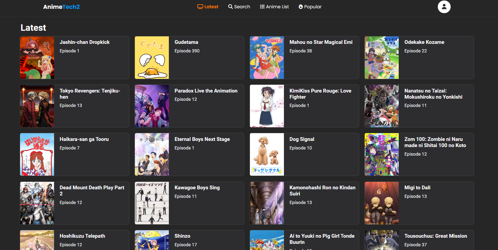
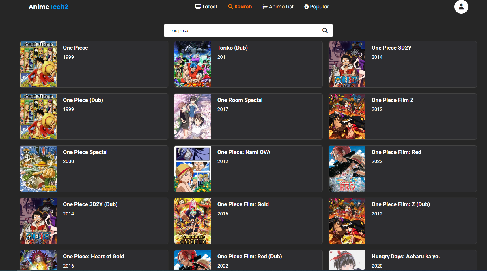
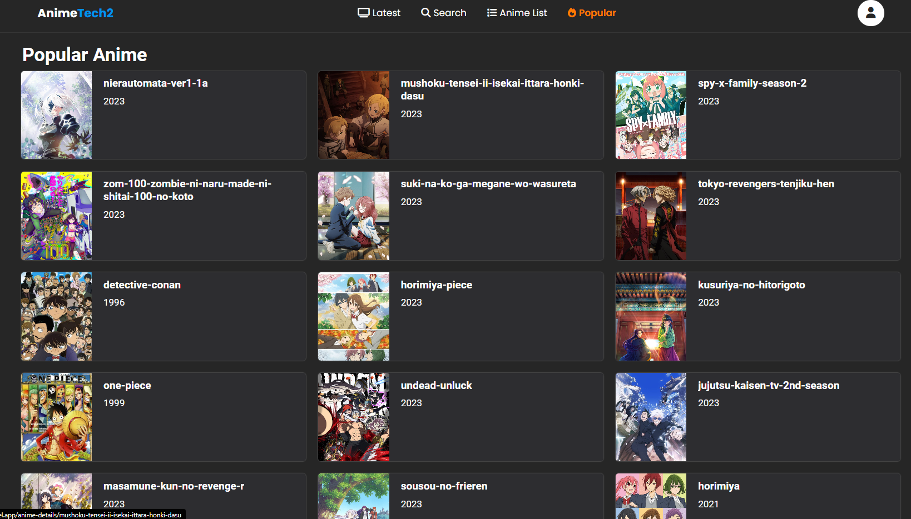
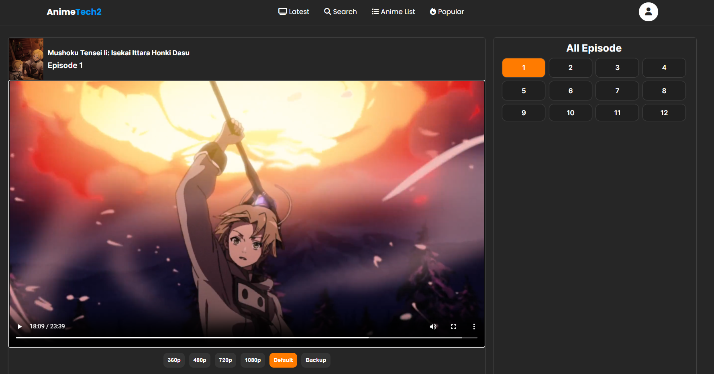
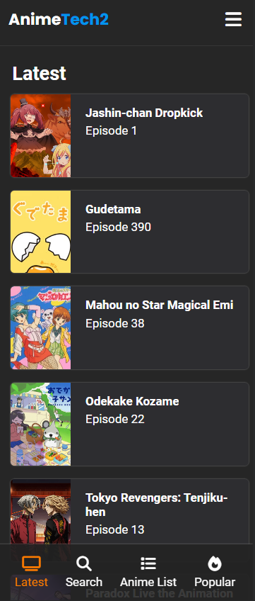
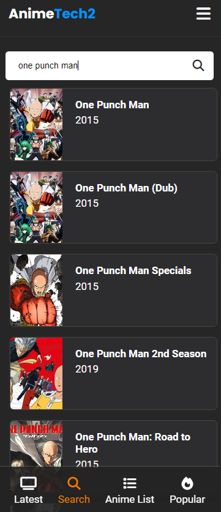
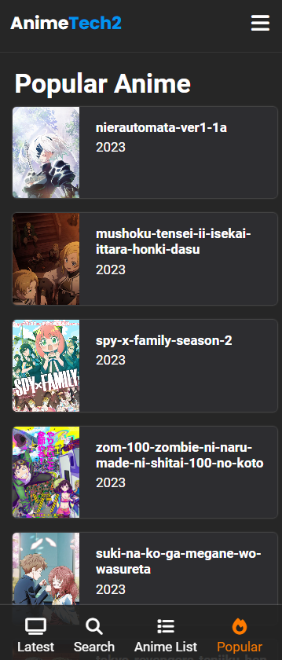
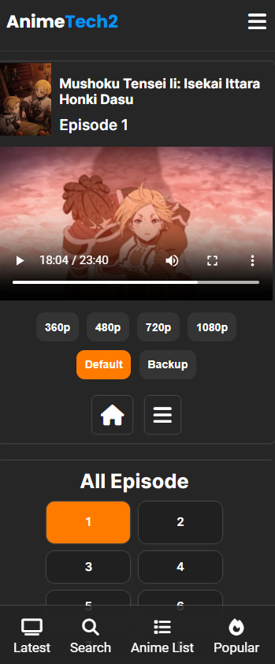

<div align="center">
  
  <h2 align="center">AnimeTech</h2>

  


  AnimeTech is fully responsive Anime Streaming website,it made by using anime api,like anify/gogo/etc, 
  <br />Responsive for all devices, built using React js and Node js for api.
  <br />Aswell have as some basic animations.
  <li align="center">Responsive design</li>

  <a href="https://animetech.vercel.app/"><strong>➥ Live Demo</strong></a>

</div>

<br />


# Getting Started with Create React App

## Install Packages
Use the following command to install the required packages:

```bash
npm install

# Start Project
In the project directory, run the following command:
```bash
npm npm start

This command launches the app in development mode.
Open [http://localhost:3000](http://localhost:3000) to view it in your browser.

### Demo Screeshots

### Desktop Home Page


### Desktop Search Page


### Desktop Popular Anime Page


### Desktop Video Page



### Android/Phone

### Desktop Home Page


### Desktop Search Page


### Desktop Popular Anime Page


### Desktop Video Page



## backend api is private now you can use original ones which availble on github (gogoanime/anify.tv docs site),etc

**Intention to make this was to learn about api,web scrapping, and learning how streaming videos actually works**
**"This project is only for testing, and you are solely responsible for its usage."** 